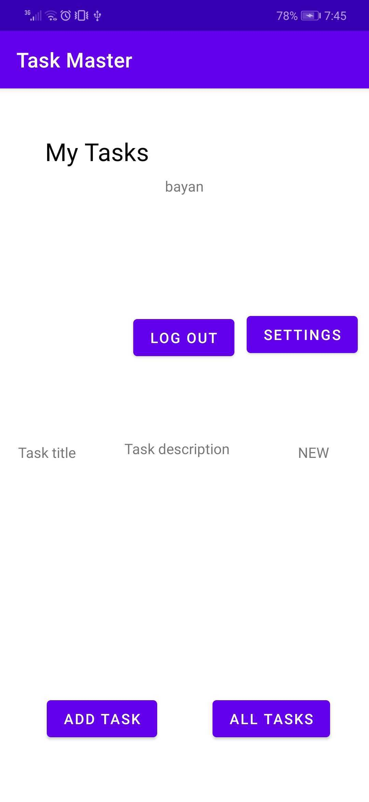

## Lab 26

## Lab 27

Home page was modified and 4 buttons are added to it to move to setting page that allows the user to enter their name and it would be shown again at the home page.

Also the Tsk page would change its title depending on the button's text.

## Lab 28

Home page displaying data using recycler view

## Lab 29

Displaying data inserted in the form in Home page and task details

## Lab 32

Today we managed to display data from DynamoDB instead of local DynamoDB

## Lab 36

Today we managed to make accounts for users.

